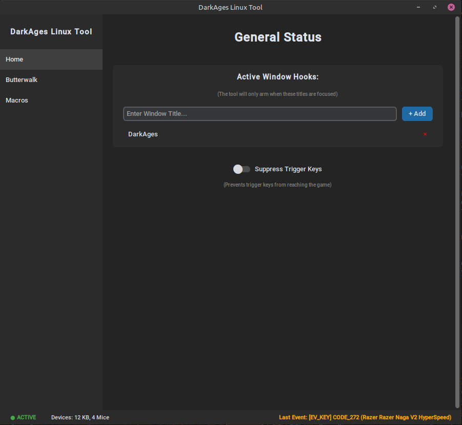

# Ugh But I Can't Use Linux Because... (Darkages Tools ported to Linux)



A movement and macro utility for Darkages players on Linux, providing a terminal-based interface to manage character movement and combat sequences.

## Core Features

### 1. Butterwalk
Enhances character movement by injecting multiple movement commands for every physical key press.
- **Directional Support:** Works with Arrow keys and optionally `ZXCV` keys.
- **Multipliers:** Adjustable speed levels (1x, 2x, or 3x) to control movement intensity.
- **Context Aware:** Automatically arms when a window matching configured titles (e.g., "Darkages") is focused.

### 2. Macros
A flexible macro system for triggering complex key and mouse sequences.
- **Wizard-based Creation:** Create macros directly in the UI with a step-by-step wizard.
- **Versatile Steps:** Supports key presses, left clicks, and right clicks.
- **Configurable Delays:** Set custom delays between each macro step (defaulting to 10ms).
- **Persistence:** Macros are saved automatically to `~/.config/ugh-darkages/macros.json`.

### 3. Modern TUI
A curses-based terminal interface with multiple tabs:
- **Home:** Overview of status, active client, and configured search titles.
- **Butterwalk:** Detailed controls for movement multiplication and key mappings.
- **Macros:** Management list and creation wizard for combat macros.

## Prerequisites
- **Python 3.10+**
- **xdotool:** Required for injecting keystrokes and mouse clicks.
  - Ubuntu/Debian: `sudo apt install xdotool`
  - Fedora: `sudo dnf install xdotool`
  - Arch: `sudo pacman -S xdotool`
- **evdev:** Python library for monitoring global input events.

## Installation

### 1. Clone the Repository
```bash
git clone https://github.com/???/ugh-but-i-cant-use-linux-because.git
cd ugh-but-i-cant-use-linux-because
```

### 2. Run Setup
The `setup.sh` script will create a virtual environment, install dependencies, and help you configure input permissions.
```bash
chmod +x setup.sh setup_permissions.sh
./setup.sh
```
**Note:** If you are added to the `input` group, you MUST log out and log back in (or restart) for changes to take effect.

## How to Run

```bash
./main.py
```
*(Or `venv/bin/python main.py` if not using the shebang)*

## Controls

### Global Navigation
- **Tab / 1-3:** Switch between Home, Butterwalk, and Macros tabs.
- **q:** Exit the application.

### Butterwalk Controls
- **Arrows:** Movement.
- **ZXCV:** Movement (if enabled).
- **+ / -:** (on numpad/physical keys) Increase / Decrease multiplier level.
- **b:** Toggle Butterwalk on/off.
- **m:** Toggle ZXCV movement mapping.

### Macro Controls
- **n:** Create a new macro.
- **d:** Delete the selected macro.
- **Space:** Manually trigger the selected macro.
- **Up/Down:** Navigate the macro list.

## Configuration
The tool uses a `.env` file (or `dotenv` template) for initial settings:
- `DARKAGES_WINDOW_NAMES`: Comma-separated list of window titles to monitor (default: "Darkages").
- `LOOP_INTERVAL`: Timing for the injection loop (default: 0.02).
- `DEFAULT_MULTIPLIER`: Initial Butterwalk level (default: 1).

## Troubleshooting
- **"Permission denied for /dev/input/":** Your user needs read access to `/dev/input/`. Run `./setup.sh` and ensure you restarted your session after joining the `input` group.
- **"Client: Searching...":** Ensure your game window title contains one of the strings defined in your `.env` (or "Darkages" by default).
- **Input not registering:** The tool requires `evdev` to monitor global keys. Ensure no other application has exclusive "grab" on your input devices.
