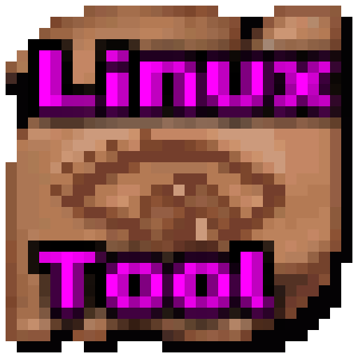

#  DALT (DarkAges Linux Tool)

  

This project is a significantly enhanced and hardened fork of the original `ugh-i-cant-use-linux-because` movement and input automation tool, as well as improved functionality from the fork of `ughlis` '. It has been modernized for better stability, security, and accessibility.

## 🚀 Key Enhancements (from ugh-i-cant-use-linux-because to Ughlis)

### 1. Security & Stability Hardening
*   **Async Process Execution**: Replaced legacy synchronous `subprocess.run` calls with `asyncio.create_subprocess_exec` combined with `await proc.communicate()`. This prevents the entire application from hanging while waiting for OS commands to return.
*   **Non-Blocking Input Subsystem**: Fully migrated low-level `evdev` device loops to cooperative asynchronous tasks. This guarantees that thread-heavy operations—like fetching active window geometries—never starve the input loop, keeping processing lag flat at near 0ms.
*   **Shell Bypass**: Switched from shell-string command execution to direct argument execution. This eliminates potential shell-injection vulnerabilities and reduces overhead.
*   **Event Debouncing**: Implemented UI time-debouncing (`after_cancel` execution windows) for macro lists, preventing "Layout Thrashing" and freezes when handling large configuration sets.
*   **Double-Input & Loop Prevention**: Added advanced verification gates to ensure virtual re-emission only occurs when hardware suppression (`suppress_triggers`) is explicitly active. Built-in window-ID checks prevent recursive infinite input feedback loops when clicking inside the application GUI.
*   **Fail-Safe Device Initialization**: Device interaction hooks are isolated inside localized exception captures. Permission blocks on `/dev/input/` bubble up as explicit system events rather than causing background workers to crash silently.

### 2. Full Controller Support
*   **Analog Joysticks**: Butterwalk movement multiplication is fully integrated with analog sticks (`ABS_X`/`ABS_Y`).
*   **DPAD Support**: Added toggleable support for DPAD movement.
*   **Virtual Buttons**: Automatic translation of analog thresholds into digital "BTN_JOY" events for macro triggering.

### 3. Advanced Macro Engine
*   **Basic Macros**: Simple key sequences with customizable delays.
*   **Complex Macros**: Full support for coordinate-based mouse clicks (Left/Right) relative to the active window.
*   **Hold vs Once**: Support for both "Once" (trigger on press) and "Hold" (repeat while key is held) execution modes.
*   **Safety Reject**: Built-in safety logic to prevent accidental binding of essential system keys (like Left Click) as triggers.
*   **Asynchronous Key Injection**: Virtual keystroke emissions are wrapped inside background event tasks (`create_task`), ensuring hotkey execution never blocks the main key-down evaluation loop.

### 4. Modern Interface (GUI & TUI)
*   **CustomTkinter GUI**: A rich graphical interface with themed components.
*   **Adaptive Tiling**: All main views (Home, Butterwalk, Editor) are wrapped in `ScrollableFrames`, allowing the app to remain fully functional even when tiled or resized to small window dimensions.
*   **Linux-Native Scrolling**: Explicit mouse-wheel support for Linux X11 environments.
*   **Classic TUI**: A fully-featured Curses-based Terminal UI for users who prefer minimal overhead.

## 🚀 Key Fixes (from Ughlis to DarkAges Linux Tool)

### 1. Enable/Disable Macros
*   **Macro Toggling**: Allows you to enable and disable macros on a whim so that you can map the same trigger key to multiple macros without interference.

### 2. Butterwalk Space Bar Functionality
*   **Space Bar Butterwalk Speed**: A toggleable option to enable Butterwalk for your Space Bar. While this does spam your space bar, the more intended functionality of this is for use with the Macro features so you can hold space and use your macro without letting go of space. Keep in mind that while enabled, typing may become difficult due to multiple space inputs.

### 3. Exact Name Match
*   **Non-Invasive Window Hooks**: Unlike the two previous versions, DarkAges Linux Tool now searches for exact window names instead of windows with the provided terms in them. 

## 🛠 Prerequisites

*   **OS**: Linux (X11 recommended)
*   **Dependencies**: `xdotool`, `python3-evdev`, `python3-tk`
*   **Permissions**: Access to `/dev/input/` (Run `sudo ./setup_permissions.sh`)

## 📖 Usage

1.  Initialize the environment: `./setup.sh`
2.  Start the tools: `./start.sh`
3.  **Toggle Butterwalk**: `b` (TUI) or use the GUI switch.
4.  **Manage Macros**: Navigate to the Macros tab to record clicks or bind triggers.

---

*Note: This fork prioritizes reliability and performance, ensuring that automation tools feel like a native extension of your workflow.*
